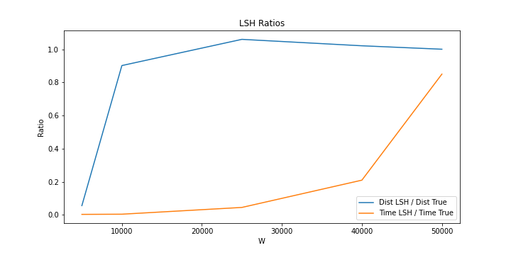
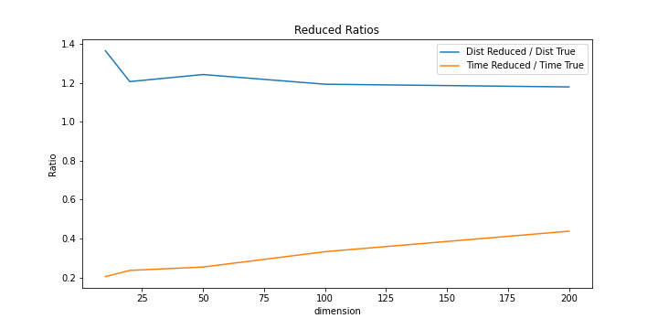
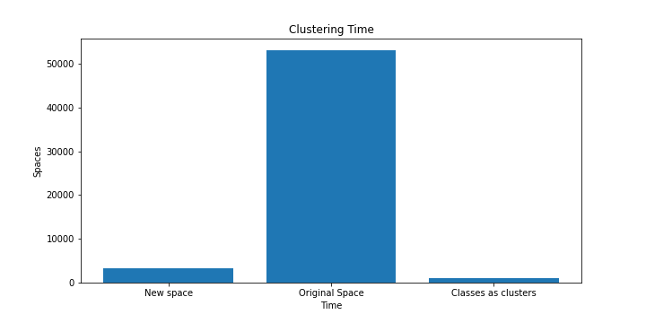
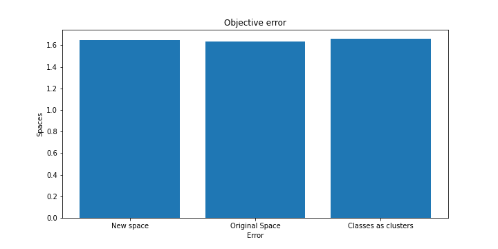
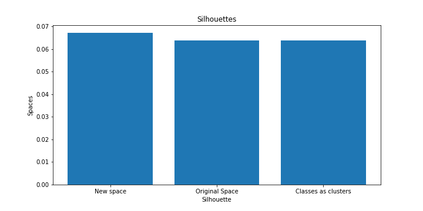

    
    <h1>University of Athens</h1>
    <h2>Department of Informatics and Telecomunications</h2>

<h3>Dionysis Taxiarchis Balaskas - 1115201700094</h3>
<h3>Andreas Giannoutsos - 1115201700021</h3>
 

# Latent vs Original Space Image Classification

<h3>Introduction to our project (info, goals, complexity, speed, results, simplicity, abstractiveness)</h3>
<h4>
Comparison of latent space produced from convolutional neuran nets vs original space af anImage classification and unsupervised learning using latent space vectors produced by convolutional neural nets together with the original vectors space image in classification and unsupervided clustering
</h4>

<h3>How we run the executables</h3>
<h4>
  To run it with google Colab:
</h4>

   

<h3>How we tested that it works</h3>
 <h4>
    We tested our scripts and executables with every possible combination, based on the project requests. For better performance we used google colab for python scripts which provides powerfull hardware with memory and GPU. Google Colab minimized the time that each experiment took. We tested many hyperparameters' combinations and found some very good models with good performance and small loss. These two were the creterions which we used to consider which experiment was the best.
 </h4> 

<h3>Project Directories and Files organization</h3>
<h4>
  
  Main Directory:
    configurations/        # Directory with hyperparameters configurations, saved on JSON form.  
    data/                  # Directory with data files.  
    models/                # Directory where models are saved.  
    outputs/               # contains data files like input/query/output/configuration.  
    src/                   # contains the '.cpp' files.  
    include/               # contains the '.h' files.  
    experiments/           # Directory where experiment's Python notebooks are saved.  
    emd/                   # Directory where EMD implementation is.  
    docs/                  # Directory with some documents and images from experiment.  
    bin/                   # the directory where the C++ executables are saved.  
    build/                 # the directory where the C++ objective files are.  
    autoencoder.py         # Autoencoder script.  
    reduce.py              # reduce script.  
    classification.py      # Classifier script.  
    model.py               # Contains functions that are used for the Neural Network creation, train and test.  
    test.py                # Creates the configuration files.  
    visualization.py       # Contains functions that are used on the visualization of the Neural Network results and predictions.  
    experiments.ipynb      # The python notebook that we run on colab.  
    *.sh                   # Scripts to run fast the executables. Used during the development.  
    
</h4>

<h3>Assumptions</h3>
<h4>
1. Our PCs where unable to run experiments with the whole datasets, at least on C++, so we reduced it. 
2. For the same reason we executed the Python experiments on Google Colab to use more data.
</h4>

<h2>Tasks</h2>

<h3>Task A</h3>
<h4>Build an image autocoding neural network that includes layers
compression and decompression (“bottleneck”). You will need to perform his training experiments
network with different hyperparameter values ​​[number of cohesive layers, size
cohesive filters, number of cohesive filters per layer, number of training seasons
(epochs), batch size, compression dimension (latent dimension, default = 10)] to
minimize the loss by avoiding overfitting. His data
entrance set must be properly divided into training set and training set
validation (validation set). Based on the experiments, you select the optimal structure for the neural network,
and the latent vector is used to represent the images in the new one
vector space.

<h4>
Execute: python reduce.py –d 'dataset' -q 'queryset' -od 'output_dataset_file' -oq
'output_query_file'</h4>

About the experiments:

We tested different models in Google Colab

We found the best architecture of the model that minimizes the loss without overfitting. Also we compiled different autoencoder models 
that reduce to different domensions the image in 20, 50, 100 and 200</h4>

<h3>Task B</h3>
<h4>Expand and use the deliverable of the first job to find the nearest one
neighbor of the search set images in the new vector space (exhaustive search)
as well as the true (LSH) and nearest (LSH) nearest neighbor to the original
vector space: all searches are done with metric Manhattan. Results
compared to the search time and the approach fraction in the original space, i.e. the mean
distance Manhattan proximal (NeuralNet or LSH) / actual nearest neighbor to
query vector in homepage.</h4>
<h4>
Execute the first task and use the outputs as the "new space files"
Execute: ./bin/search –d 'input file original space' -i 'input file new space' –q 'query file
original space' -s 'query file new space' –k 'int' -L 'int' -ο 'output file'</h4>

About the experiments:

We tested different latent space dimensions and the resutls can be found here  

The LSH from the experiments seems to have very good results when the number of w is 20000. The calculation time remains short and the accuracy is quite high.

    

The reduced dimension has a very short calculation time when the dimensions are small. But accuracy is not close to LSH results. As we increase the dimension, the accuracy increases as the calculation time increases. However, the computation time grows faster than the accuracy, therefore a small number of dimensions close to 20.

    

<h3>Task C</h3>
<h4>Implement the Earth Mover’s Distance (EMD) metric reduced to solving a Linear problem
Linear Programming. Exhaustively find the 10 closest neighbors and
compare execution time and "correctness" versus exhaustive query search
B. The information provided by the image labels is used for "correctness". As a measure
The percentage of the nearest neighbors that have the same label as the image is set
question mark. Perform experiments on different sized clusters when calculating the distance
EMD and comment on the results in terms of time and "correctness".</h4>
<h4>
Execute: ./emd/search_emd.py -d 'input file original space' –q 'query file original space' -l1 
'labels of input dataset' -l2 'labels of query dataset' -ο 'output file' -EMD</h4>

About the experimets:

The results can be found here  for different compinations of cluster windows.

MNIST proved to be very good for manhattan distance. As the images have the same orientation and the labels do not differ much between them it is very easy for this metric to draw conclusions about the images.

On the other hand earths mover's distance is a better technique that compares image distributions and can learn and better compare the different features of each image even if they have a different orientation.

However, this metric in MNIST did not seem to work well as it took a long time to calculate and was not very accurate. Accuracy begins to improve with a larger cluster but the computation time increases geometrically and it is much more difficult to calculate.

<h3>Task D</h3>
<h4>Group S1 k-medians of the images of the input set in the new space and
let S2 be in the original space. Use of the deliverable of the 2nd task to categorize the images
of the input set and clustering S3 based on it. Extension and use of the deliverable of the 1st
to compare the three silhouettes in terms of silhouette and its evaluation
target function in the original space (k ~ 10) with Manhattan metric.</h4>
<h4>
Execute: ./bin/cluster –d 'input file original space' -i 'input file new space'
-n 'classes from NN as clusters file' –c 'configuration file' -o 'output file'</h4>

About the experiments:

We plotted the results from the clustering here 

    

From the results we can see that clustering in the real space of dimensions takes much more time than that in smaller dimensions with the use of a neural network.

    

    

In addition the cost of the objective function as well as the price of the silhouette are almost similar compared to the real space.

Therefore the reduction of dimensions in smaller vector spaces seems to be quite useful for clustering in relation to the computation in real space.
